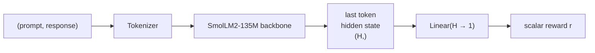
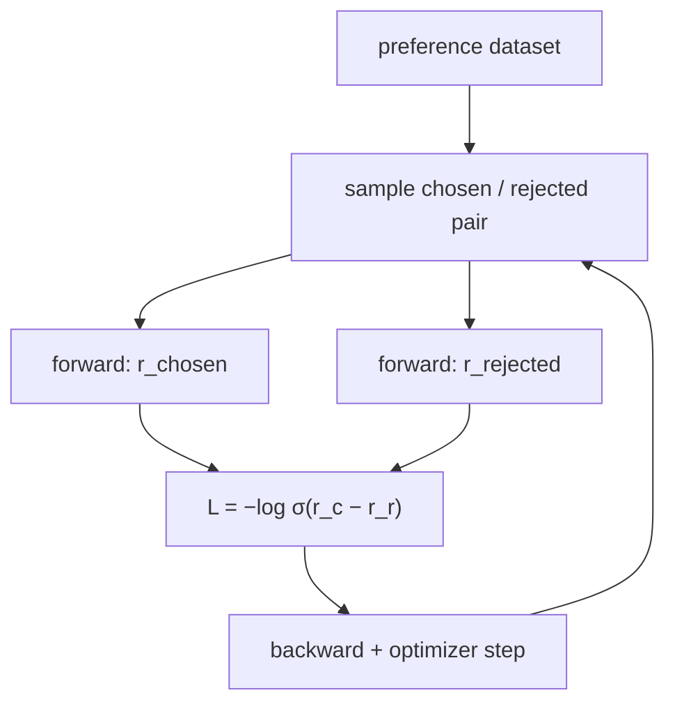

# 031 — Reward Modeling

## Overview

A reward model (RM) is a neural network that predicts how much a human would prefer one response over another. It converts subjective human judgements into a scalar signal that downstream RL algorithms (like PPO) can optimize.

This module implements the Bradley-Terry preference model on top of a pretrained LM backbone. Given a (prompt, chosen response, rejected response) triple from a human preference dataset, the RM is trained to assign a higher score to the chosen response.

## Algorithm

**Bradley-Terry loss**

For a preference pair (y_w = chosen, y_l = rejected):

```
r_w = RM(prompt + y_w)   # scalar reward for chosen
r_l = RM(prompt + y_l)   # scalar reward for rejected

L = -log σ(r_w - r_l)    # σ = sigmoid
```

The model is correct when `r_w > r_l`. The loss pushes the margin `r_w - r_l` to be large and positive.

**Architecture**



**Training loop**



## Dataset

`trl-lib/ultrafeedback_binarized` — 60k preference pairs derived from UltraFeedback. Each example contains a prompt, a chosen response (higher quality), and a rejected response (lower quality), with preference labels sourced from GPT-4 annotations.

## Key Takeaways

- **Bradley-Terry model**: A pairwise comparison model. Training on `(chosen, rejected)` pairs teaches relative preferences, not absolute quality.
- **Last token aggregation**: Causal LMs attend left-to-right, so the last token's hidden state has seen the entire sequence — it's the natural choice for a scalar output.
- **Reward margin**: `r_w - r_l` is the key metric during training. A rising margin means the model is correctly separating preferences.
- **Accuracy metric**: Fraction of pairs where `r_chosen > r_rejected`. A random model starts at ~50%; a well-trained RM should exceed 70%.
- **This RM is used by module 033**: The saved checkpoint is loaded by the RLHF pipeline as the reward signal for PPO.

## Usage

```bash
uv sync
uv run python src/train.py --help
uv run python src/train.py --steps 500 --generate 3
```

The trained reward model is saved to `checkpoints/rm.pt`.

## References

- [InstructGPT (Ouyang et al., 2022)](https://arxiv.org/abs/2203.02155)
- [Learning to summarize from human feedback (Stiennon et al., 2020)](https://arxiv.org/abs/2009.01325)
- [Bradley-Terry Model (1952)](https://www.jstor.org/stable/2334029)
