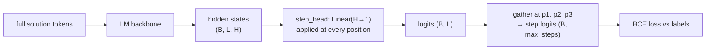
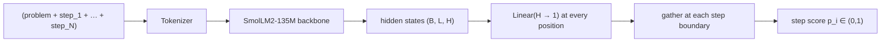

# 032 — PRM (Process Reward Model)

## Overview

An outcome reward model (ORM, module 031) gives one score per complete response. A **Process Reward Model** goes further: it assigns a correctness score to every reasoning **step**, making it possible to detect exactly where a chain of thought goes wrong.

PRMs are central to training and evaluating LLMs on tasks that require multi-step reasoning (math, code, logic). They power step-level beam search at inference time and provide denser supervision during RL fine-tuning than a single end-of-sequence reward.

This module trains a PRM on **Math-Shepherd**, a dataset of GSM8K math solutions annotated with per-step labels derived from Monte-Carlo rollouts.

## Label semantics

Math-Shepherd labels are **outcome-based, not locally correct**:

- `+` — continuing from this step, MC rollouts reached the correct final answer.
- `-` — continuing from this step, no MC rollout reached the correct final answer.

A step labelled `+` does not mean its reasoning is perfect in isolation; it means the solution is still **recoverable** from that point. A `-` step means the solution has already diverged: either this step or a preceding step introduced an error that cannot be corrected by the remaining steps.

## Algorithm

**Single-pass step scoring**

```
Input solution:  Problem  │  Step 1 ки │  Step 2 ки │  Step 3 ки
                                ↑              ↑              ↑
                           position p1    position p2    position p3
```



The backbone runs **once** per solution. Step logits are extracted by indexing the output at the token position corresponding to the last token of each `ки` marker. This is O(1) extra cost per step — no repeated forward passes.

**Loss**

```
for each valid (b, step_i):
    L += BCE(logit[b, p_i], label[b, step_i])
L /= total_valid_steps
```

BCE (not Bradley-Terry) because labels are absolute (correct / incorrect), not relative between two responses.

**Architecture**



**Solution-level score at inference**

```
score(solution) = min(p_1, p_2, …, p_N)
```

The minimum reflects the weakest link: one bad step invalidates the solution. Alternatives: product of probabilities, or the score of the final step only.

## Dataset

`peiyi9979/Math-Shepherd` — ~80k GSM8K solutions with step-level correctness labels from MC rollouts. Each example:

- `input`: problem + steps, each step ending with ` ки`
- `label`: same text with `ки` replaced by `+` or `-`

## Key Takeaways

- **ORM vs PRM**: ORMs give one scalar per response (sparse signal). PRMs give one scalar per step (dense signal). PRMs catch reasoning errors before they reach the final answer.
- **MC rollout labels**: Math-Shepherd labels are process-level but derived from outcomes. A step is `+` if a correct answer is reachable from it, not if the step itself is locally error-free.
- **Single forward pass**: The PRM runs the backbone once per solution and gathers logits at step-boundary positions — efficient even for long chains.
- **BCE vs Bradley-Terry**: Labels are absolute (correct/incorrect), so binary cross-entropy is the right loss. Bradley-Terry (module 031) is for relative preference pairs.
- **Step-level beam search**: At inference, PRMs enable beam search that prunes beams when any step probability drops below a threshold — this is the "best-of-N" strategy used in math reasoning models.
- **Minimum step score**: The weakest step drives the solution quality metric. A single `-` step makes the whole solution suspect.

## References

- [Let's Verify Step by Step (Lightman et al., 2023)](https://arxiv.org/abs/2305.20050) — OpenAI PRM800K, the paper that popularised step-level reward models
- [Math-Shepherd (Wang et al., 2024)](https://arxiv.org/abs/2312.08935) — automatic step-level annotation via MC rollouts; the dataset used here
- [Scaling LLM Test-Time Compute (Snell et al., 2024)](https://arxiv.org/abs/2408.03314) — using PRMs for best-of-N and beam search at inference
