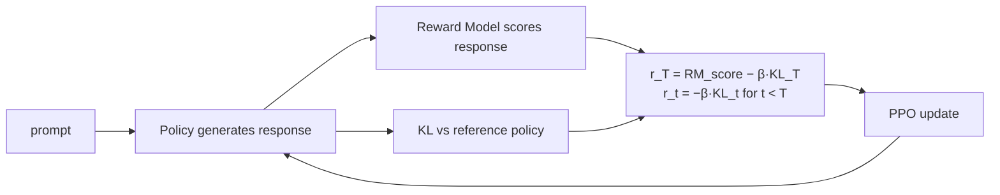
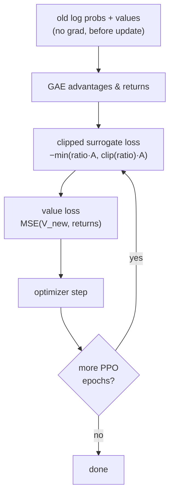

# 033 — RLHF (InstructGPT Style)

## Overview

RLHF (Reinforcement Learning from Human Feedback) is the technique behind InstructGPT and ChatGPT. A language model is fine-tuned with PPO to maximise a reward signal that comes from a separately trained reward model — which itself was trained on human preference data (module 031).

This module implements the full RL loop: generate a response, score it with the reward model, and update the policy with PPO while keeping a KL divergence penalty against the reference (pre-fine-tuning) model to prevent reward hacking.

## Algorithm

**Full RLHF pipeline**



**Per-token reward decomposition**

The reward at each response token t:

```
r_t = −β · KL_t          for t < T  (penalise drift from reference)
r_T = RM_score − β · KL_T           (RM signal only at the last token)

KL_t = log π_θ(a_t) − log π_ref(a_t)
```

**PPO update**



**GAE (Generalised Advantage Estimation)**

Working backwards over the response sequence:

```
δ_t  = r_t + γ · V(t+1) − V(t)
A_t  = δ_t + (γλ) · A_{t+1}
R_t  = A_t + V(t)         (return for value loss)
```

## Dataset

`trl-lib/ultrafeedback_binarized` — only the prompt fields are used. The policy generates its own responses, which are then scored by the reward model.

## Key Takeaways

- **Two-model setup**: The policy being fine-tuned and a frozen reference copy of the same model. The reference is needed to compute KL.
- **KL penalty**: Without it, the policy quickly learns to produce degenerate text that fools the reward model (reward hacking). β controls the trade-off between reward maximisation and staying close to the pretrained distribution.
- **Token-level RL**: Each token is an "action". The advantage at each step is estimated by GAE over the response sequence.
- **Value head**: Predicts expected future reward from each position. Critical for low-variance advantage estimates.
- **Sparse reward + dense KL**: The RM gives a single scalar per response (sparse). KL is a dense per-token signal. Together they shape every gradient step.
- **Prerequisite**: Run module 031 first to get a meaningful reward model checkpoint (`031-reward-modeling/checkpoints/rm.pt`). Without it, a random-init RM is used and scores will be noise.

## Usage

```bash
uv sync

# With trained reward model from 031:
uv run python src/train.py --steps 200 --reward-model-path ../031-reward-modeling/checkpoints/rm.pt --generate 3

# Standalone (random-init reward model):
uv run python src/train.py --steps 200 --generate 3
```

## References

- [InstructGPT (Ouyang et al., 2022)](https://arxiv.org/abs/2203.02155)
- [PPO (Schulman et al., 2017)](https://arxiv.org/abs/1707.06347)
- [Learning to summarize from human feedback (Stiennon et al., 2020)](https://arxiv.org/abs/2009.01325)
