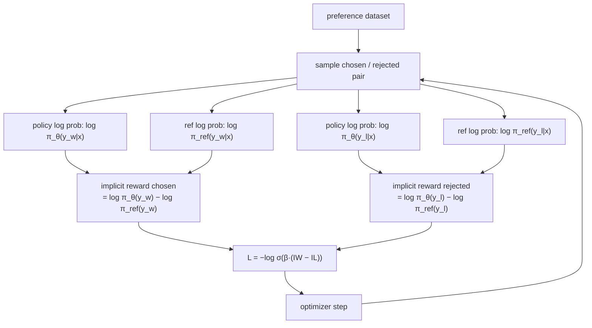

# 034 — DPO (Direct Preference Optimization)

## Overview

DPO eliminates the need for a separate reward model by reparameterising the RLHF objective. The key insight is that the optimal policy under the RLHF objective has an analytic form in terms of the reference policy — so the reward can be expressed directly as a log-ratio, and the whole problem reduces to a supervised loss on preference pairs.

No RL loop, no reward model, no value function. Just a supervised update on (prompt, chosen, rejected) triples.

## Algorithm

**Derivation intuition**

Under the RLHF KL-constrained objective, the optimal policy satisfies:

```
π*(y|x) ∝ π_ref(y|x) · exp(r(x,y) / β)
```

Rearranging, the implicit reward is:

```
r(x,y) = β · log[π*(y|x) / π_ref(y|x)] + β · log Z(x)
```

Since Z(x) cancels in the preference probability, the Bradley-Terry objective becomes:

```
L_DPO = -log σ(β · [(log π_θ(y_w|x) - log π_ref(y_w|x))
                    - (log π_θ(y_l|x) - log π_ref(y_l|x))])
```

**Training loop**



**Sequence log prob computation**


Response tokens are selected by masking prompt positions with -100.

## Dataset

`trl-lib/ultrafeedback_binarized` — same as module 031. Each example provides a `(prompt, chosen, rejected)` triple.

## Key Takeaways

- **No reward model needed**: The RM is implicitly defined by the log-ratio `log π_θ / log π_ref`. This makes DPO dramatically simpler to implement and more stable to train.
- **β controls KL budget**: β → 0 allows unlimited deviation from π_ref. β → ∞ forces π_θ = π_ref. In practice β ∈ [0.05, 0.5] works well.
- **Implicit reward margin**: `(log π(y_w) - log π_ref(y_w)) - (log π(y_l) - log π_ref(y_l))` should increase during training — analogous to reward margin in module 031.
- **Reference model is frozen**: π_ref is computed once per batch and never updated. It acts as an anchor preventing catastrophic forgetting.
- **DPO vs RLHF**: DPO is simpler and often more stable, but RLHF (033) allows online generation — the policy can explore beyond the preference dataset distribution.

## References

- [DPO (Rafailov et al., 2023)](https://arxiv.org/abs/2305.18290)
- [InstructGPT (Ouyang et al., 2022)](https://arxiv.org/abs/2203.02155)
